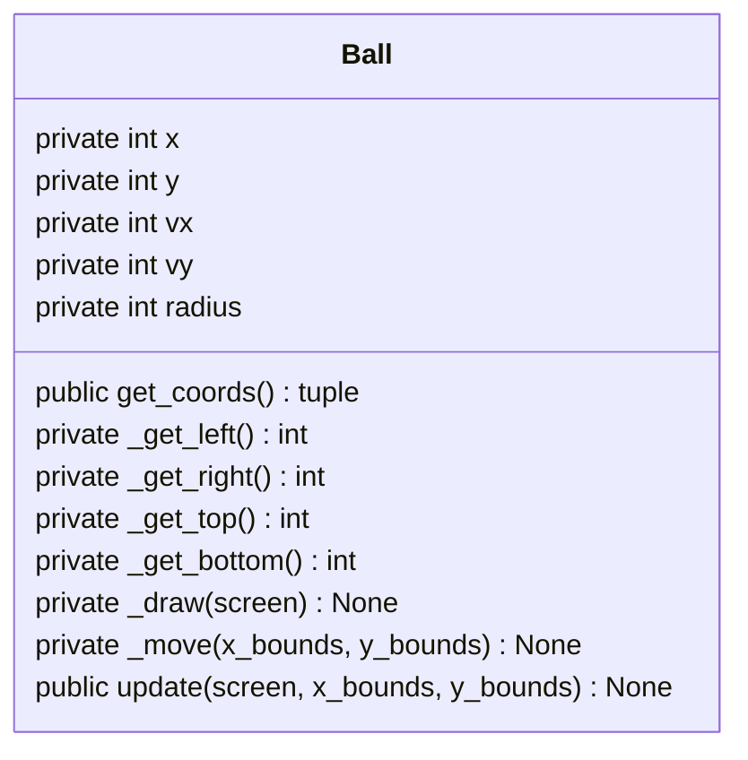

# Lesson 2

- [Lesson files](#lesson-files)
- [Worksheet](#worksheet)
    - [Investigate](#investigate)
    - [Modify](#modify)
    - [Make](#make)
- [Homework](#homework)
    - [Requirements](#requirements)
    - [Options](#options)

## Lesson files

### [models.py](models.py)
```python

```

### [main.py](main.py)
```python

```

## Worksheet

### Investigate
Answer these questions by examining the code.

1. What does `from models import Ball` do in `main.py`?
1. Why does `main.py` create a list of balls instead of storing them in separate variables?
1. What do the two `for` loops do in `main.py`?
1. What does `p_color=(255, 0, 0), p_vx=0, p_vy=0` mean in the constructor signature in `models.py`?
1. Why does the `Ball` object need all of the parameters as attributes? 
1. Why are the `_draw` and `_move` methods private?
1. Why does `update` call both `move` and `draw`?
1. Why does the `_draw` method need `screen` as a parameter?

### Modify
Make changes to explore how the code works.

1. Implement the `_draw` method
1. Implement the `_move` method
    - At this stage, **do not** implement bouncing


### Make
1. Use the class diagram below to implement the missing `get` methods (`get_coords`, `_get_left`, `_get_right`, `_get_top`, `_get_bottom`).

    The `_get_<direction>` methods should return the position of the ball's edge in that direction (hint: how can you use the ball's radius to work this out?).



2. Once all the getters work, update `move` so the ball cannot leave the window.
    - When the ball reaches and edge, it should bounce by reversing the appropriate velocity.

You will need to update the `update` method:
E.g.,
```python
def update(self, screen, x_bounds, y_bounds):
    """
    Move and draw the ball.

    Parameters:
        screen: a pygame screen
        x_bounds: a tuple containing the lower and upper x bounds, e.g. (0, WIDTH)
        y_bounds: a tuple containing the lower and upper y bounds, e.g. (0, HEIGHT)
    """
    self._move(x_bounds, y_bounds)
    self._draw(screen)
```

## Homework

### Requirements

- 


### Options
Choose two or more optional enhancements:
- 
